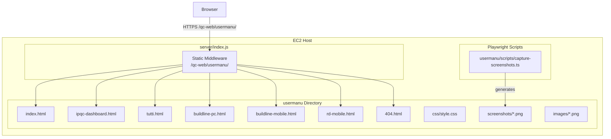
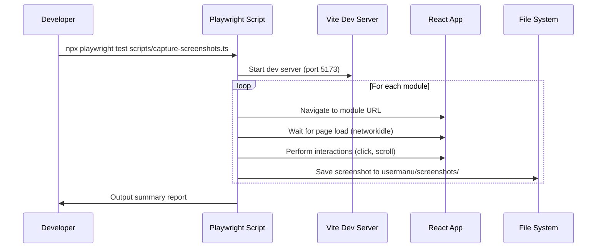
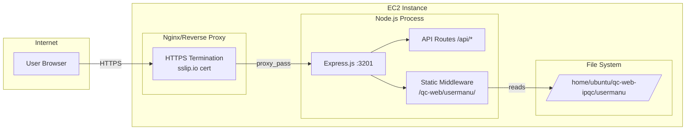
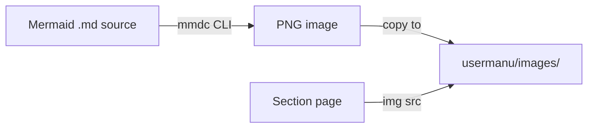
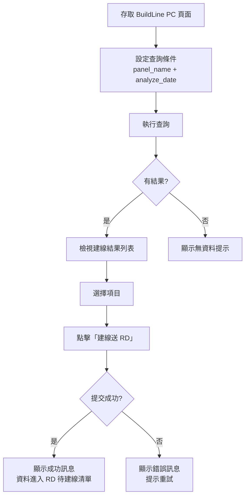
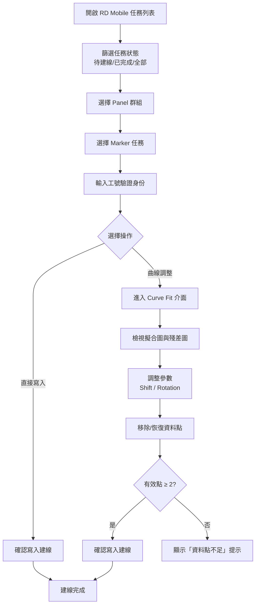
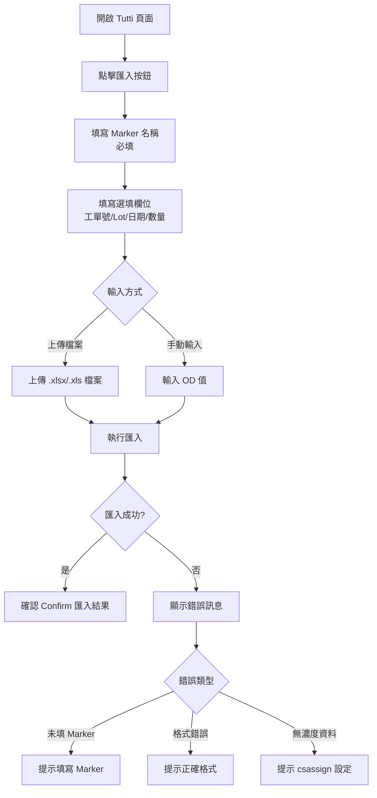
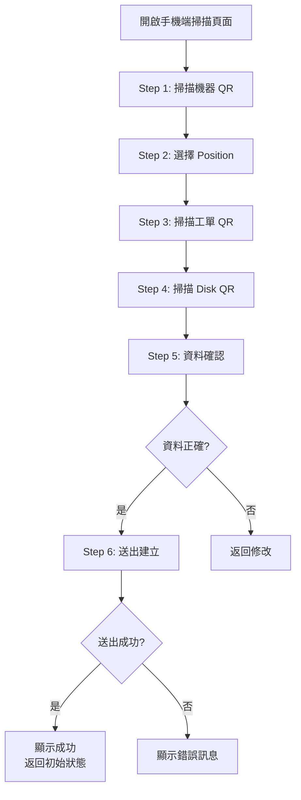

# Design Document: IPQC User Manual Static Website

## Overview

本設計文件描述 qc-web-ipqc 系統使用說明網站的技術架構。該網站為純靜態 HTML/CSS 專案，部署於 `/home/ubuntu/qc-web-ipqc/usermanu` 目錄，透過現有 Express.js 伺服器以靜態檔案中介軟體提供服務。

專案採用零建置工具策略（no build tools, no frameworks），所有頁面為獨立 HTML 檔案，搭配共用 CSS 樣式與 Playwright 自動截圖腳本。設計重點在於：可離線瀏覽（file:// 協定相容）、響應式佈局（320px–1920px）、以及截圖自動化更新機制。

## Architecture




## Project Structure

```
usermanu/
├── index.html                  # 首頁（模組目錄）
├── ipqc-dashboard.html         # IPQC 管理儀表板說明
├── tutti.html                  # Tutti Beads Pre Assignment 說明
├── buildline-pc.html           # 建線管理 PC 端說明
├── buildline-mobile.html       # 手機端建立測試資料說明
├── rd-mobile.html              # Skyla RD 建線說明
├── 404.html                    # 404 錯誤頁面
├── css/
│   └── style.css               # 共用樣式（響應式）
├── screenshots/
│   ├── Dashboard_overview_01.png
│   ├── Tutti_import_modal_01.png
│   ├── BuildLinePC_query_01.png
│   ├── BuildLineMobile_scan_01.png
│   └── RdMobile_tasklist_01.png
├── images/
│   ├── workflow_buildline_pc.png
│   ├── workflow_rd_mobile.png
│   └── workflow_tutti_import.png
└── scripts/
    └── capture-screenshots.ts  # Playwright 截圖自動化腳本
```


## Components and Interfaces

### Component 1: HTML Page Template

**Purpose**: 提供所有頁面的統一結構，確保一致的導覽體驗與樣式。

**Template Structure**:
```html
<!DOCTYPE html>
<html lang="zh-TW">
<head>
  <meta charset="UTF-8">
  <meta name="viewport" content="width=device-width, initial-scale=1.0">
  <title>{Page Title} - IPQC 使用說明</title>
  <link rel="stylesheet" href="css/style.css">
</head>
<body>
  <header class="site-header">
    <a href="index.html" class="logo">IPQC 使用說明</a>
    <nav class="main-nav" aria-label="主導覽">
      <button class="nav-toggle" aria-expanded="false">☰</button>
      <ul class="nav-list">
        <li><a href="ipqc-dashboard.html">IPQC Dashboard</a></li>
        <li><a href="tutti.html">Tutti</a></li>
        <li><a href="buildline-pc.html">BuildLine PC</a></li>
        <li><a href="buildline-mobile.html">BuildLine Mobile</a></li>
        <li><a href="rd-mobile.html">RD Mobile</a></li>
      </ul>
    </nav>
  </header>
  <main class="content">
    <!-- Page content here -->
  </main>
  <footer class="site-footer">
    <nav class="page-nav" aria-label="章節導覽">
      <a href="{prev_page}" class="nav-prev">← 上一章</a>
      <a href="index.html" class="nav-home">首頁</a>
      <a href="{next_page}" class="nav-next">下一章 →</a>
    </nav>
  </footer>
</body>
</html>
```

**Responsibilities**:
- 提供語義化 HTML5 結構
- 包含響應式 viewport meta tag
- 統一導覽列與頁尾章節導覽
- 僅使用相對路徑引用資源


### Component 2: Navigation System

**Purpose**: 提供模組間快速跳轉與章節前後導覽。

**Page Order** (用於前後章節連結):
1. `ipqc-dashboard.html` — IPQC 管理儀表板
2. `tutti.html` — Tutti Beads Pre Assignment
3. `buildline-pc.html` — 建線管理 PC 端
4. `buildline-mobile.html` — 手機端建立測試資料
5. `rd-mobile.html` — Skyla RD 建線

**Navigation Rules**:
- 首頁 (`index.html`): 顯示所有模組卡片連結，無前後章節導覽
- 第一章 (`ipqc-dashboard.html`): 無「上一章」連結
- 最後一章 (`rd-mobile.html`): 無「下一章」連結
- 所有章節頁面: 包含返回首頁連結

**Mobile Navigation**:
- 視窗寬度 < 768px 時，主導覽列收合為漢堡選單
- 點擊 `.nav-toggle` 按鈕展開/收合導覽列表
- 使用純 CSS 實現（`:target` 或 checkbox hack），不依賴 JavaScript

### Component 3: Index Page (首頁)

**Purpose**: 作為使用說明入口，展示所有模組目錄。

**Content Structure**:
- 網站標題與簡介
- 模組卡片網格（每個模組一張卡片）
- 每張卡片包含：模組名稱、簡短描述、連結至對應頁面

### Component 4: Section Pages (章節頁面)

**Purpose**: 各功能模組的詳細操作說明。

**Content Pattern** (每個章節頁面遵循):
1. 章節標題 (`<h1>`)
2. 功能概述段落
3. 操作步驟區塊（ordered list + 截圖）
4. 工作流程圖（若適用）
5. 錯誤處理說明
6. 頁尾章節導覽


## CSS Architecture

### Design Principles

- 單一 CSS 檔案 (`css/style.css`)，無預處理器
- Mobile-first 響應式設計
- CSS Custom Properties (variables) 管理色彩與間距
- 無外部依賴（無 CDN、無 icon fonts）

### CSS Structure

```css
/* === CSS Custom Properties === */
:root {
  --color-primary: #1a73e8;
  --color-primary-dark: #1557b0;
  --color-bg: #ffffff;
  --color-bg-alt: #f8f9fa;
  --color-text: #202124;
  --color-text-muted: #5f6368;
  --color-border: #dadce0;
  --spacing-xs: 0.25rem;
  --spacing-sm: 0.5rem;
  --spacing-md: 1rem;
  --spacing-lg: 2rem;
  --spacing-xl: 3rem;
  --max-width: 960px;
  --radius: 8px;
}

/* === Base Reset & Typography === */
/* === Layout: Header, Main, Footer === */
/* === Navigation (Desktop & Mobile) === */
/* === Index Page: Module Cards Grid === */
/* === Section Pages: Step Lists === */
/* === Screenshots: Responsive Images === */
/* === Workflow Diagrams === */
/* === 404 Error Page === */
/* === Responsive Breakpoints === */
```

### Responsive Breakpoints

| Breakpoint | Target | Layout Changes |
|-----------|--------|----------------|
| Default (< 768px) | Mobile 320px+ | 單欄佈局、漢堡選單、圖片 100% 寬 |
| ≥ 768px | Tablet | 雙欄卡片網格、展開導覽列 |
| ≥ 1024px | Desktop | 三欄卡片網格、側邊留白增加 |
| ≥ 1920px | Large Desktop | max-width 限制、置中內容 |

### Screenshot Display Rules

```css
.screenshot {
  max-width: 100%;
  height: auto;
  border: 1px solid var(--color-border);
  border-radius: var(--radius);
  margin: var(--spacing-md) 0;
  box-shadow: 0 2px 8px rgba(0, 0, 0, 0.1);
}

/* PC screenshots: constrain to 800px max */
.screenshot--pc { max-width: 800px; }

/* Mobile screenshots: constrain to 375px max */
.screenshot--mobile { max-width: 375px; }
```


## Screenshot Automation Design

### Sequence Diagram



### Screenshot Script Architecture

```typescript
// usermanu/scripts/capture-screenshots.ts
interface ScreenshotTask {
  name: string;           // e.g., "Dashboard_overview_01"
  url: string;            // relative URL path
  viewport: { width: number; height: number };
  actions?: Action[];     // optional interactions before capture
  selector?: string;      // optional: capture specific element
  waitFor?: string;       // CSS selector to wait for
}

interface Action {
  type: 'click' | 'fill' | 'select' | 'wait';
  target: string;         // CSS selector
  value?: string;         // for fill/select actions
}

interface CaptureResult {
  name: string;
  success: boolean;
  path?: string;
  error?: string;
  duration: number;       // ms
}
```

### Screenshot Naming Convention

Format: `{Module}_{description}_{sequence}.png`

| Module | Examples |
|--------|----------|
| Dashboard | `Dashboard_overview_01.png`, `Dashboard_kpi_cards_02.png` |
| DriedBeads | `DriedBeads_table_view_01.png`, `DriedBeads_search_02.png` |
| IPQC | `IPQC_csv_import_01.png`, `IPQC_od_analysis_02.png` |
| Tutti | `Tutti_import_modal_01.png`, `Tutti_fields_filled_02.png` |
| BuildLinePC | `BuildLinePC_query_01.png`, `BuildLinePC_results_02.png` |
| BuildLineMobile | `BuildLineMobile_scan_qr_01.png`, `BuildLineMobile_position_02.png` |
| RdMobile | `RdMobile_tasklist_01.png`, `RdMobile_curve_fit_02.png` |

### Viewport Configurations

| Module Type | Width | Height | Rationale |
|-------------|-------|--------|-----------|
| PC modules | 1920 | 1080 | Standard desktop resolution |
| BuildLine Mobile | 375 | 812 | iPhone SE/standard mobile |
| RD Mobile | 390 | 844 | iPhone 14 standard |


### Error Handling in Screenshot Script

```typescript
// Timeout and retry strategy
const SCREENSHOT_TIMEOUT = 10_000;  // 10s per screenshot
const TOTAL_TIMEOUT = 120_000;      // 120s total execution

// On failure: skip screenshot, record error, continue
// On completion: print summary report
interface SummaryReport {
  total: number;
  success: number;
  failed: number;
  skipped: CaptureResult[];  // failed items with error details
  duration: number;          // total execution time in ms
}
```

### NPM Script Integration

```json
{
  "scripts": {
    "manual:screenshots": "npx playwright test usermanu/scripts/capture-screenshots.ts --config=usermanu/scripts/playwright.screenshot.config.ts"
  }
}
```

Dedicated Playwright config for screenshots (`usermanu/scripts/playwright.screenshot.config.ts`):
```typescript
import { defineConfig } from '@playwright/test';

export default defineConfig({
  testDir: '.',
  timeout: 120_000,
  use: {
    baseURL: 'http://localhost:5173',
    headless: true,
    screenshot: 'off',  // manual control
  },
  webServer: {
    command: 'npx vite --port 5173',
    port: 5173,
    reuseExistingServer: true,
    cwd: '../../',  // project root
  },
});
```


## Deployment Configuration

### Express.js Static Middleware

Add to `server/index.js`:

```javascript
import path from 'path';
import { fileURLToPath } from 'url';

const __dirname = path.dirname(fileURLToPath(import.meta.url));

// Serve user manual static files
app.use('/qc-web/usermanu', express.static(
  path.join(__dirname, '..', 'usermanu'),
  {
    index: 'index.html',
    extensions: ['html'],
    fallthrough: true,
  }
));

// 404 fallback for manual site
app.use('/qc-web/usermanu/*', (req, res) => {
  res.status(404).sendFile(
    path.join(__dirname, '..', 'usermanu', '404.html')
  );
});
```

### Deployment Diagram



### URL Routing

| URL Path | Served File | Notes |
|----------|-------------|-------|
| `/qc-web/usermanu/` | `usermanu/index.html` | 首頁 |
| `/qc-web/usermanu/ipqc-dashboard.html` | `usermanu/ipqc-dashboard.html` | Dashboard 說明 |
| `/qc-web/usermanu/tutti.html` | `usermanu/tutti.html` | Tutti 說明 |
| `/qc-web/usermanu/buildline-pc.html` | `usermanu/buildline-pc.html` | PC 建線說明 |
| `/qc-web/usermanu/buildline-mobile.html` | `usermanu/buildline-mobile.html` | 手機建線說明 |
| `/qc-web/usermanu/rd-mobile.html` | `usermanu/rd-mobile.html` | RD 建線說明 |
| `/qc-web/usermanu/css/style.css` | `usermanu/css/style.css` | 樣式表 |
| `/qc-web/usermanu/screenshots/*` | `usermanu/screenshots/*` | 截圖圖片 |
| `/qc-web/usermanu/images/*` | `usermanu/images/*` | 工作流程圖 |
| `/qc-web/usermanu/{not-found}` | `usermanu/404.html` | 404 錯誤頁 |


## Workflow Diagram Generation

### Approach

工作流程圖以 Mermaid 語法撰寫於 Markdown 原始檔中，再透過 Mermaid CLI (`@mermaid-js/mermaid-cli`) 轉換為 PNG 圖片存放於 `images/` 目錄。

### Generation Pipeline



### Workflow Diagrams Required

#### 1. BuildLine PC Workflow



#### 2. RD Mobile Workflow



#### 3. Tutti Import Workflow



#### 4. BuildLine Mobile Workflow



### Mermaid to PNG Conversion Command

```bash
# Install mermaid CLI (one-time)
npm install -g @mermaid-js/mermaid-cli

# Generate all workflow diagrams
mmdc -i usermanu/diagrams/workflow_buildline_pc.md -o usermanu/images/workflow_buildline_pc.png -w 800
mmdc -i usermanu/diagrams/workflow_rd_mobile.md -o usermanu/images/workflow_rd_mobile.png -w 800
mmdc -i usermanu/diagrams/workflow_tutti_import.md -o usermanu/images/workflow_tutti_import.png -w 800
mmdc -i usermanu/diagrams/workflow_buildline_mobile.md -o usermanu/images/workflow_buildline_mobile.png -w 800
```


## Data Models

### Page Metadata

每個 HTML 頁面的元資料（用於導覽系統生成）：

```typescript
interface PageMeta {
  filename: string;       // e.g., "ipqc-dashboard.html"
  title: string;          // 頁面標題
  shortTitle: string;     // 導覽列顯示名稱
  description: string;    // 首頁卡片描述
  order: number;          // 章節順序 (1-5)
  prev?: string;          // 上一章檔名
  next?: string;          // 下一章檔名
}
```

### Screenshot Task Registry

```typescript
interface ScreenshotRegistry {
  module: string;
  tasks: ScreenshotTask[];
}

// Complete registry of all required screenshots
const SCREENSHOT_REGISTRY: ScreenshotRegistry[] = [
  {
    module: 'Dashboard',
    tasks: [
      { name: 'Dashboard_overview_01', url: '/qc-web/', viewport: { width: 1920, height: 1080 } },
      { name: 'Dashboard_kpi_cards_02', url: '/qc-web/', viewport: { width: 1920, height: 1080 }, selector: '.kpi-section' },
    ]
  },
  {
    module: 'Tutti',
    tasks: [
      { name: 'Tutti_import_modal_01', url: '/qc-web/pre-assignment/tutti', viewport: { width: 1920, height: 1080 }, actions: [{ type: 'click', target: '[data-testid="import-btn"]' }] },
      { name: 'Tutti_fields_filled_02', url: '/qc-web/pre-assignment/tutti', viewport: { width: 1920, height: 1080 } },
    ]
  },
  {
    module: 'BuildLinePC',
    tasks: [
      { name: 'BuildLinePC_query_01', url: '/qc-web/pre-assignment/build-lines', viewport: { width: 1920, height: 1080 } },
      { name: 'BuildLinePC_results_02', url: '/qc-web/pre-assignment/build-lines', viewport: { width: 1920, height: 1080 } },
    ]
  },
  {
    module: 'BuildLineMobile',
    tasks: [
      { name: 'BuildLineMobile_scan_qr_01', url: '/qc-web/pre-assignment/tutti-scan', viewport: { width: 375, height: 812 } },
    ]
  },
  {
    module: 'RdMobile',
    tasks: [
      { name: 'RdMobile_tasklist_01', url: '/qc-web/pre-assignment/rd-mobile', viewport: { width: 390, height: 844 } },
      { name: 'RdMobile_curve_fit_02', url: '/qc-web/pre-assignment/rd-mobile', viewport: { width: 390, height: 844 } },
    ]
  },
];
```


## Correctness Properties

### Property 1: Relative Path Integrity

所有 HTML 檔案中的 `href` 和 `src` 屬性值皆為相對路徑（不以 `/` 或 `http` 開頭），確保 file:// 協定相容性。

**Validates: Requirements 1.6, 1.7**

**Formal**: ∀ file ∈ usermanu/*.html, ∀ attr ∈ {href, src} of file: ¬startsWith(attr.value, "/") ∧ ¬startsWith(attr.value, "http")

### Property 2: Navigation Completeness

每個章節頁面（order 1–5）皆包含返回首頁連結；非首尾章節包含前後章節連結。

**Validates: Requirements 2.3, 2.4**

**Formal**: ∀ page where 1 ≤ page.order ≤ 5: hasLink(page, "index.html") ∧ (page.order > 1 ⟹ hasLink(page, pages[page.order-1].filename)) ∧ (page.order < 5 ⟹ hasLink(page, pages[page.order+1].filename))

### Property 3: Screenshot Coverage

Screenshot Registry 中定義的每個 task 在執行後皆產生對應的 PNG 檔案於 `screenshots/` 目錄。

**Validates: Requirements 8.1, 8.2**

**Formal**: ∀ task ∈ SCREENSHOT_REGISTRY.tasks: exists("usermanu/screenshots/" + task.name + ".png")

### Property 4: Responsive Layout Invariant

在 320px ≤ viewport width ≤ 1920px 範圍內，所有導覽連結可見且可點擊，文字不溢出容器。

**Validates: Requirements 2.5**

**Formal**: ∀ width ∈ [320, 1920], ∀ link ∈ nav-links: isVisible(link, width) ∧ isClickable(link, width) ∧ ¬overflows(link.text, link.container, width)

### Property 5: File Existence Consistency

所有 HTML 中引用的 CSS、圖片路徑對應的檔案皆存在於專案目錄中。

**Validates: Requirements 1.5, 1.6**

**Formal**: ∀ file ∈ usermanu/*.html, ∀ ref ∈ resourceRefs(file): exists(resolve(file.dir, ref))

### Property 6: Page Order Consistency

章節頁面的 prev/next 連結形成完整的雙向鏈結串列（第一頁無 prev，最後一頁無 next）。

**Validates: Requirements 2.4**

**Formal**: pages[1].prev = ∅ ∧ pages[5].next = ∅ ∧ ∀ i ∈ [2,5]: pages[i].prev = pages[i-1].filename ∧ ∀ i ∈ [1,4]: pages[i].next = pages[i+1].filename

### Property 7: Screenshot Naming Convention

所有截圖檔名符合 `{Module}_{description}_{sequence}.png` 格式。

**Validates: Requirements 8.3**

**Formal**: ∀ file ∈ usermanu/screenshots/*.png: matches(file.name, /^[A-Z][a-zA-Z]+_[a-z_]+_\d{2}\.png$/)

## Error Handling

### Scenario 1: 404 Page Not Found

**Condition**: 使用者存取 `/qc-web/usermanu/` 下不存在的路徑
**Response**: Express fallback middleware 回傳 `404.html`，頁面包含錯誤說明與返回首頁連結
**Recovery**: 使用者點擊返回首頁連結

### Scenario 2: Screenshot Capture Failure

**Condition**: Playwright 截圖時目標頁面載入失敗或元素未出現
**Response**: 跳過該截圖，記錄錯誤至 `CaptureResult`
**Recovery**: 執行結束時輸出失敗清單，開發者手動排查後重新執行

### Scenario 3: Navigation Link Target Missing

**Condition**: 使用者點擊的導覽連結對應頁面尚未建立
**Response**: 瀏覽器顯示 404 頁面（由 Express fallback 處理）
**Recovery**: 404 頁面提供返回首頁連結

### Scenario 4: Offline Browsing (file:// protocol)

**Condition**: 使用者以 file:// 協定開啟 HTML 檔案
**Response**: 所有相對路徑資源正常載入（CSS、圖片）
**Limitation**: Express 404 fallback 不可用，瀏覽器顯示原生錯誤

## Testing Strategy

### Manual Testing Checklist

1. **Navigation**: 驗證所有頁面間連結正確跳轉
2. **Responsive**: 在 320px、768px、1024px、1920px 寬度下檢查佈局
3. **Offline**: 以 file:// 協定開啟 index.html 驗證離線可用性
4. **404**: 存取不存在路徑驗證 404 頁面顯示
5. **Images**: 確認所有截圖與流程圖正確顯示

### Automated Validation

```bash
# Validate HTML structure (optional, using html-validate)
npx html-validate usermanu/*.html

# Check for broken internal links
grep -roh 'href="[^"]*"' usermanu/*.html | sort -u | while read link; do
  # verify each relative link target exists
done

# Verify all referenced images exist
grep -roh 'src="[^"]*"' usermanu/*.html | sort -u | while read img; do
  # verify each image file exists
done
```

### Screenshot Automation Test

```bash
# Run screenshot generation and verify output
npm run manual:screenshots
# Verify expected number of screenshots generated
ls usermanu/screenshots/*.png | wc -l
```

## Performance Considerations

- **Page Size**: 每個 HTML 頁面目標 < 50KB（不含圖片）
- **Image Optimization**: 截圖使用 PNG 格式，建議壓縮至 < 200KB/張
- **No JavaScript**: 頁面不依賴 JS，首次載入即完整渲染
- **CSS Single File**: 單一 CSS 檔案避免多次 HTTP 請求
- **Response Time**: Express static middleware 直接讀取檔案系統，回應時間 < 100ms

## Security Considerations

- **Static Content Only**: 無動態內容、無使用者輸入處理、無資料庫存取
- **Same Origin**: 透過與主應用相同的 HTTPS 域名提供服務
- **No External Resources**: 不載入外部 CDN 或第三方資源
- **Content-Type Headers**: Express static middleware 自動設定正確的 MIME types

## Dependencies

| Dependency | Purpose | Version |
|-----------|---------|---------|
| Express.js | Static file serving | Already in server/package.json |
| @playwright/test | Screenshot automation | ^1.59.1 (already installed) |
| @mermaid-js/mermaid-cli | Workflow diagram PNG generation | Latest (dev dependency) |
| html-validate | Optional HTML validation | Latest (dev dependency) |

**No runtime dependencies added** — the user manual is pure static HTML/CSS served by the existing Express.js server.
