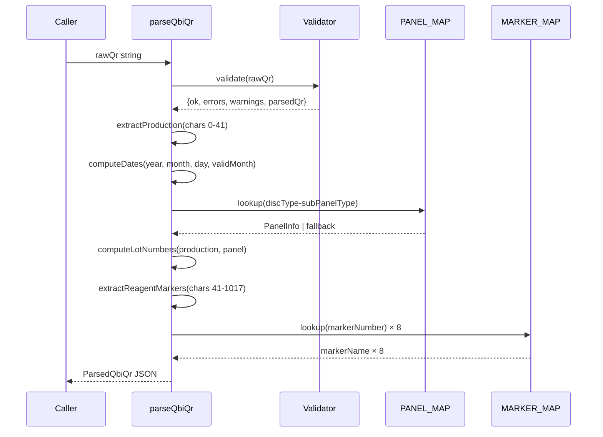

# Design Document: Qbi QR Parser Core

## Overview

A pure TypeScript parser function `parseQbiQr(rawQr: string)` that decodes Qbi Disc QR Code strings (fixed-length numeric strings of 1173 characters) into structured JSON. The parser extracts production parameters, reagent/marker data, and cartridge information from three sequential sections of the QR string, performs lookups against constant maps, and accumulates errors/warnings for invalid input.

## Main Algorithm/Workflow



## Core Interfaces/Types

```typescript
// src/lib/qbiQrParser.ts

export type ParsedQbiQr = {
  ok: boolean;
  errors: string[];
  warnings: string[];

  raw: {
    inputLength: number;
    parsedLength: number;
    extraTail?: string;
  };

  production: {
    formatVersion: string;
    year: string;
    month: string;
    day: string;
    productionDate: string;   // YYYY-MM-DD
    expirationDate: string;   // YYYY-MM-DD
    factoryNumber: string;
    lineNumber: string;
    batchNumber: string;
    validMonth: string;
    discType: string;
    subPanelType: string;
    salesCode: string;
    brandCode: string;
    humanVet: string;
    serialNumber: string;
    appCode: string;
    lotTraceNo: string;
    reserved: string;
  };

  panel: {
    panelKey: string;
    panelName: string;
    productCode: string | null;
    discCategory: string;
  };

  lot: {
    discLotNo: string;
    reportLotNo: string;
    whiteBoxLotNo: string | null;
  };

  markerWellMap: Array<{
    index: number;
    markerNumber: string;
    markerName: string;
    wellNumber: string;
    speciesLine: string;
    speciesName: string;
    used: boolean;
  }>;
};

// src/constants/panelMap.ts

export type PanelInfo = {
  panelName: string;
  productCode: string;
  onePieceBoxPanelType: string;
  discCategory: string;
};

export const PANEL_MAP: Record<string, PanelInfo> = {
  "00-001": {
    panelName: "Core Chem 13",
    productCode: "905-100",
    onePieceBoxPanelType: "000001",
    discCategory: "Vet 生化",
  },
  // Extensible: add more panels here
};

// src/constants/markerMap.ts

export const MARKER_MAP: Record<string, string> = {
  "033": "UCRE",
  "034": "UPRO",
  // Extensible: add more markers here
};

export const SPECIES_LINE_MAP: Record<string, string> = {
  "0": "Control",
  "1": "Dog",
  "2": "Cat",
  "3": "Horse",
  // Extensible: add more species here
};
```

## Key Functions with Formal Specifications

### Function 1: parseQbiQr()

```typescript
function parseQbiQr(rawQr: string): ParsedQbiQr
```

**Preconditions:**
- `rawQr` is a string (may be empty, may contain non-numeric chars)

**Postconditions:**
- Returns a valid `ParsedQbiQr` object
- If `rawQr` contains non-numeric characters: `result.ok === false`, `result.errors` contains descriptive message
- If `rawQr.length > 1173`: parses first 1173 chars, `result.raw.extraTail` contains remainder, `result.warnings` has length warning
- If `rawQr.length < 1173`: parses available chars, `result.warnings` has length warning
- If `rawQr.length === 1173` and all numeric and valid dates: `result.ok === true`
- No side effects, no mutations to input

### Function 2: extractProduction()

```typescript
function extractProduction(qr: string): ProductionFields
```

**Preconditions:**
- `qr` is a string of at least 41 numeric characters (the production section)

**Postconditions:**
- Returns object with all 17 production fields extracted by fixed-position slicing
- Each field is a string of the correct length
- No mutations to input

### Function 3: computeDates()

```typescript
function computeDates(
  year: string, month: string, day: string, validMonth: string
): { productionDate: string; expirationDate: string; errors: string[] }
```

**Preconditions:**
- `year`, `month`, `day` are 2-digit numeric strings
- `validMonth` is a 2-digit numeric string

**Postconditions:**
- `productionDate` format: `YYYY-MM-DD` where year is `20${year}`
- `expirationDate` = productionDate + validMonth months - 1 day, format `YYYY-MM-DD`
- If date is invalid (e.g., month > 12, day > 31): `errors` array contains descriptive message
- Handles month/year boundaries correctly

**Loop Invariants:** N/A

### Function 4: lookupPanel()

```typescript
function lookupPanel(discType: string, subPanelType: string): PanelLookupResult
```

**Preconditions:**
- `discType` is a 2-char string
- `subPanelType` is a 3-char string

**Postconditions:**
- `panelKey` = `${discType}-${subPanelType}`
- If key exists in PANEL_MAP: returns matching PanelInfo fields
- If key not found: `panelName = "Unknown Panel"`, `productCode = null`, `discCategory = "Unknown"`

### Function 5: computeLotNumbers()

```typescript
function computeLotNumbers(production: ProductionFields, productCode: string | null): LotNumbers
```

**Preconditions:**
- `production` contains valid lineNumber, subPanelType, year, month, day, batchNumber, salesCode
- `productCode` may be null

**Postconditions:**
- `discLotNo` = `${lineNumber}-${subPanelType}-${YYMMDD}${batchNumber}`
- `reportLotNo` = `${lineNumber}${subPanelType}${YYMMDD}${batchNumber}`
- `whiteBoxLotNo` = `${salesCode last char}-${productCode no dash}-${YYMMDD}${batchNumber}` if productCode exists, else `null`

### Function 6: extractMarkers()

```typescript
function extractMarkers(qr: string): MarkerEntry[]
```

**Preconditions:**
- `qr` is the full QR string (or at least 1017 chars for complete reagent section)

**Postconditions:**
- Returns array of exactly 8 marker entries
- Each entry extracted from 122-char block starting at offset `41 + index * 122`
- `markerNumber === "000"` → `used = false`
- `markerNumber !== "000"` → `used = true`
- `markerName` looked up from MARKER_MAP, fallback "Unknown Marker"
- `speciesName` looked up from SPECIES_LINE_MAP, fallback "Unknown"

## Algorithmic Pseudocode

### Main Parsing Algorithm

```typescript
function parseQbiQr(rawQr: string): ParsedQbiQr {
  const errors: string[] = [];
  const warnings: string[] = [];
  let ok = true;

  // Step 1: Validate input contains only digits
  if (!/^\d*$/.test(rawQr)) {
    ok = false;
    errors.push("QR contains non-numeric characters");
  }

  // Step 2: Handle length variations
  let parsedQr = rawQr;
  let extraTail: string | undefined;

  if (rawQr.length > 1173) {
    parsedQr = rawQr.slice(0, 1173);
    extraTail = rawQr.slice(1173);
    warnings.push(`QR length ${rawQr.length} exceeds 1173, extra tail stored`);
  } else if (rawQr.length < 1173) {
    warnings.push(`QR length ${rawQr.length} is less than expected 1173`);
  }

  // Step 3: Extract production section (chars 1-41, 0-based 0-41)
  const production = extractProduction(parsedQr);

  // Step 4: Compute dates
  const dates = computeDates(
    production.year, production.month, production.day, production.validMonth
  );
  if (dates.errors.length > 0) {
    ok = false;
    errors.push(...dates.errors);
  }

  // Step 5: Panel lookup
  const panel = lookupPanel(production.discType, production.subPanelType);

  // Step 6: Compute lot numbers
  const lot = computeLotNumbers(production, panel.productCode);

  // Step 7: Extract reagent markers (chars 42-1017, 0-based start 41)
  const markerWellMap = extractMarkers(parsedQr);

  // Step 8: Assemble result
  return {
    ok,
    errors,
    warnings,
    raw: {
      inputLength: rawQr.length,
      parsedLength: parsedQr.length,
      ...(extraTail !== undefined && { extraTail }),
    },
    production: {
      ...production,
      productionDate: dates.productionDate,
      expirationDate: dates.expirationDate,
    },
    panel,
    lot,
    markerWellMap,
  };
}
```

### Date Computation Algorithm

```typescript
function computeDates(
  year: string, month: string, day: string, validMonth: string
): { productionDate: string; expirationDate: string; errors: string[] } {
  const errors: string[] = [];
  const fullYear = 2000 + parseInt(year, 10);
  const m = parseInt(month, 10);
  const d = parseInt(day, 10);
  const vm = parseInt(validMonth, 10);

  // Validate date components
  const prodDate = new Date(fullYear, m - 1, d);
  if (
    prodDate.getFullYear() !== fullYear ||
    prodDate.getMonth() !== m - 1 ||
    prodDate.getDate() !== d
  ) {
    errors.push(`Invalid production date: ${fullYear}-${month}-${day}`);
  }

  // Format production date
  const productionDate = `${fullYear}-${month}-${day}`;

  // Compute expiration: productionDate + validMonth months - 1 day
  const expDate = new Date(fullYear, m - 1 + vm, d - 1);
  const expirationDate = [
    expDate.getFullYear().toString(),
    String(expDate.getMonth() + 1).padStart(2, "0"),
    String(expDate.getDate()).padStart(2, "0"),
  ].join("-");

  return { productionDate, expirationDate, errors };
}
```

### Marker Extraction Algorithm

```typescript
const REAGENT_START = 41;       // 0-based start of reagent section
const MARKER_BLOCK_LENGTH = 122;
const MARKER_COUNT = 8;

function extractMarkers(qr: string): MarkerEntry[] {
  const markers: MarkerEntry[] = [];

  for (let i = 0; i < MARKER_COUNT; i++) {
    const blockStart = REAGENT_START + i * MARKER_BLOCK_LENGTH;
    const block = qr.slice(blockStart, blockStart + MARKER_BLOCK_LENGTH);

    const markerNumber = block.slice(0, 3);   // 1-based pos 1-3
    const wellNumber = block.slice(3, 5);     // 1-based pos 4-5
    const speciesLine = block.slice(121, 122); // 1-based pos 122

    const used = markerNumber !== "000";
    const markerName = used
      ? (MARKER_MAP[markerNumber] ?? "Unknown Marker")
      : "";
    const speciesName = SPECIES_LINE_MAP[speciesLine] ?? "Unknown";

    markers.push({
      index: i,
      markerNumber,
      markerName,
      wellNumber,
      speciesLine,
      speciesName,
      used,
    });
  }

  return markers;
}
```

### Lot Number Computation Algorithm

```typescript
function computeLotNumbers(
  production: ProductionFields,
  productCode: string | null
): LotNumbers {
  const { lineNumber, subPanelType, year, month, day, batchNumber, salesCode } = production;
  const yymmdd = `${year}${month}${day}`;

  // Disc Lot: lineNumber-subPanelType-YYMMDDbatchNumber
  const discLotNo = `${lineNumber}-${subPanelType}-${yymmdd}${batchNumber}`;

  // Report Lot: lineNumber + subPanelType + YYMMDD + batchNumber
  const reportLotNo = `${lineNumber}${subPanelType}${yymmdd}${batchNumber}`;

  // White Box Lot: salesCode last char - productCode no dash - YYMMDDbatchNumber
  let whiteBoxLotNo: string | null = null;
  if (productCode) {
    const salesLastChar = salesCode.slice(-1);
    const productCodeNoDash = productCode.replace(/-/g, "");
    whiteBoxLotNo = `${salesLastChar}-${productCodeNoDash}-${yymmdd}${batchNumber}`;
  }

  return { discLotNo, reportLotNo, whiteBoxLotNo };
}
```

## Example Usage

```typescript
import { parseQbiQr } from "./lib/qbiQrParser";

// Example 1: Normal QR (1173 numeric chars)
const qr = "002505160000120000100009999900000000000000330101..."; // 1173 chars
const result = parseQbiQr(qr);

console.log(result.ok);                    // true
console.log(result.production.productionDate); // "2025-05-16"
console.log(result.production.expirationDate); // "2026-05-15"
console.log(result.panel.panelName);       // "Core Chem 13"
console.log(result.lot.discLotNo);         // "0-001-25051600"

// Example 2: QR with extra characters
const longQr = qr + "99999";
const result2 = parseQbiQr(longQr);
console.log(result2.ok);                   // true
console.log(result2.raw.extraTail);        // "99999"
console.log(result2.warnings.length > 0);  // true

// Example 3: Invalid QR (non-numeric)
const badQr = "ABC" + "0".repeat(1170);
const result3 = parseQbiQr(badQr);
console.log(result3.ok);                   // false
console.log(result3.errors.length > 0);    // true

// Example 4: Marker inspection
const usedMarkers = result.markerWellMap.filter(m => m.used);
console.log(usedMarkers[0].markerName);    // "UCRE"
console.log(usedMarkers[0].wellNumber);    // "01"
```

## Correctness Properties

*A property is a characteristic or behavior that should hold true across all valid executions of a system — essentially, a formal statement about what the system should do. Properties serve as the bridge between human-readable specifications and machine-verifiable correctness guarantees.*

### Property 1: Parsing round-trip consistency (production fields)

*For any* valid 1173-character numeric QR string, extracting the production fields and concatenating them in order must reproduce the original first 41 characters of the QR string.

**Validates: Requirements 2.1, 2.2**

### Property 2: Length invariant

*For any* input string, `result.raw.inputLength` equals the original string length, and `result.raw.parsedLength` equals `min(inputLength, 1173)`.

**Validates: Requirements 1.5, 1.6**

### Property 3: Marker count invariant

*For any* input QR string of at least 1017 numeric characters, `result.markerWellMap` always contains exactly 8 entries with indices 0 through 7.

**Validates: Requirements 6.1**

### Property 4: Unused marker identification

*For any* marker entry where `markerNumber === "000"`, `used` must be `false` and `markerName` must be empty string. Conversely, for any marker entry where `markerNumber !== "000"`, `used` must be `true`.

**Validates: Requirements 6.6, 6.7**

### Property 5: Panel lookup fallback consistency

*For any* QR string where the panel key does not exist in PANEL_MAP, `panelName` must be "Unknown Panel", `productCode` must be `null`, and `discCategory` must be "Unknown".

**Validates: Requirements 4.3**

### Property 6: White box lot null when no product code

*For any* parsed result where `panel.productCode` is `null`, `lot.whiteBoxLotNo` must also be `null`.

**Validates: Requirements 5.4**

### Property 7: Non-numeric input always fails

*For any* input string containing at least one non-digit character, `result.ok` must be `false` and `result.errors` must be non-empty.

**Validates: Requirements 1.1**

### Property 8: Expiration date is always after production date

*For any* valid QR string with valid date fields (valid month, day, year) and `validMonth > 0`, the expiration date must be strictly after the production date.

**Validates: Requirements 3.4**

### Property 9: Lot number derivation from production fields

*For any* valid 1173-character numeric QR string, `discLotNo` must equal `${lineNumber}-${subPanelType}-${year}${month}${day}${batchNumber}` and `reportLotNo` must equal `${lineNumber}${subPanelType}${year}${month}${day}${batchNumber}`, where all components are taken from the production fields.

**Validates: Requirements 5.1, 5.2**
