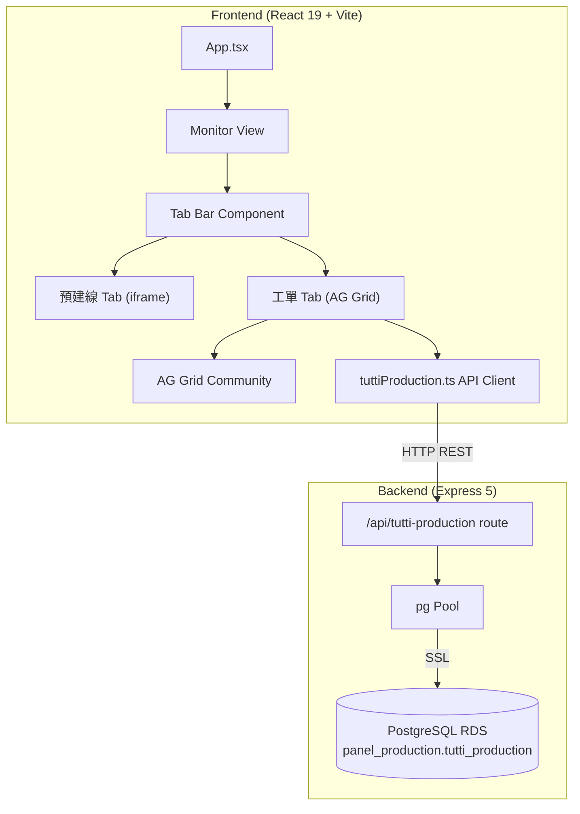

# Design Document: Tutti Production Tab

## Overview

This feature adds a "Tutti 工單" (Work Order) sub-tab to the existing Tutti/Monitor view in the QC Web application. The tab presents an AG Grid-based spreadsheet for managing Tutti panel production records, backed by a PostgreSQL RDS table (`panel_production.tutti_production`). The design introduces:

1. A tab navigation system within the monitor view (preserving the existing iframe-based "預建線" tab)
2. A new Express route module connecting to PostgreSQL RDS for CRUD operations
3. A React component wrapping AG Grid Community with inline editing, auto-calculation, filtering, and record management

The architecture follows the existing project patterns: Express route files in `server/routes/`, API client modules in `src/api/`, and page components in `src/components/`.

## Architecture



### Key Design Decisions

1. **Separate route file**: A new `server/routes/tuttiProduction.js` keeps production record logic isolated from the existing `tutti.js` (which handles curve/OD data in SQLite). This avoids coupling two different data domains.

2. **PostgreSQL via `pg` pool**: The `pg` library is already a dependency. A dedicated pool module (`server/db/pgPool.js`) manages the RDS connection with retry logic, separate from the SQLite connection used by other routes.

3. **Client-side filtering with server fallback**: The work order filter uses a debounced API call (server-side `ILIKE` query) rather than client-side filtering, since the dataset can grow to 10,000 rows and server-side filtering is more efficient.

4. **Tab state in React state (not URL)**: Tab selection is stored in component state (reset on page reload per requirements). The monitor view preserves tab state across sidebar navigation via a `useRef` pattern.

5. **AG Grid Community (no Enterprise)**: Uses the already-installed `@ag-grid-community` packages. Column grouping, inline editing, and client-side row model are all available in Community edition.

## Components and Interfaces

### Frontend Components

```
src/components/Tutti/
├── TuttiPage.tsx              (existing - iframe wrapper, unchanged)
├── TuttiMonitorView.tsx       (NEW - tab container with tab bar)
└── TuttiProductionTab.tsx     (NEW - AG Grid production record grid)
```

#### TuttiMonitorView

Replaces the direct `<TuttiPage />` render in App.tsx. Manages tab state and conditionally renders either the iframe or the production grid.

```typescript
interface TuttiMonitorViewProps {}

// Internal state:
// - activeTab: '預建線' | '工單' (default: '預建線')
// - iframeLoaded: boolean (tracks if iframe was ever mounted)
```

#### TuttiProductionTab

The main grid component. Handles data fetching, inline editing, record creation/deletion, and filtering.

```typescript
interface TuttiProductionTabProps {
  isActive: boolean; // triggers data fetch when becoming active
}
```

### API Client

```
src/api/tuttiProduction.ts
```

```typescript
export interface TuttiProductionRecord {
  id: number;
  lot_no: string;
  work_order_number: string;
  product_name: string | null;
  production_order_quantity: number | null;
  model_pn: string | null;
  sheet_name: string | null;
  line: number | null;
  well_position: number | null;
  reagent_slot: string | null;
  reagent_name: string | null;
  batch_number: string | null;
  quantity: number | null;
  formula_number: string | null;
  welding_parameter_number: string | null;
  production_quantity: number | null;
  defect_quantity: number | null;
  qa_inspection: number | null;
  storage_quantity: number | null;
  labeling_status: string | null;
  diluent_box_status: string | null;
  assembly_status: string | null;
  packaging_status: string | null;
  boxing_status: string | null;
  created_at: string;
  updated_at: string;
  created_by: string | null;
}

export function fetchTuttiProduction(workOrder?: string): Promise<TuttiProductionRecord[]>;
export function createTuttiProduction(data: Partial<TuttiProductionRecord>): Promise<TuttiProductionRecord>;
export function updateTuttiProduction(id: number, fields: Partial<TuttiProductionRecord>): Promise<TuttiProductionRecord>;
export function deleteTuttiProduction(id: number): Promise<{ ok: boolean }>;
```

### Backend Components

```
server/
├── db/pgPool.js               (NEW - PostgreSQL connection pool + init)
└── routes/tuttiProduction.js   (NEW - CRUD REST endpoints)
```

#### pgPool.js

```javascript
// Exports:
export const pool;           // pg.Pool instance
export async function initPg(); // Creates schema + table, called on startup
```

Configuration:
- Host: `database-1.cfutwrwyrxts.ap-northeast-1.rds.amazonaws.com`
- Port: 5432
- Database: `beadsdb`
- User: `harryguo`
- SSL: `{ rejectUnauthorized: false }`
- Pool: `{ min: 2, max: 10, connectionTimeoutMillis: 10000 }`

Retry logic: On query failure due to connection loss, retry up to 3 times with 2000ms delay.

#### tuttiProduction.js Routes

| Method | Path | Description |
|--------|------|-------------|
| GET | `/api/tutti-production` | List all records (optional `?work_order=` filter) |
| POST | `/api/tutti-production` | Create record |
| PUT | `/api/tutti-production/:id` | Update record |
| DELETE | `/api/tutti-production/:id` | Delete record |

### Storage Quantity Calculation

A shared pure function used by both frontend and backend:

```typescript
function computeStorageQuantity(
  productionQty: number | null,
  defectQty: number | null,
  qaInspection: number | null
): number {
  const prod = productionQty ?? 0;
  const defect = defectQty ?? 0;
  const qa = qaInspection ?? 0;
  return Math.max(0, prod - defect - qa);
}
```

## Data Models

### PostgreSQL Table: `panel_production.tutti_production`

```sql
CREATE SCHEMA IF NOT EXISTS panel_production;

CREATE TABLE IF NOT EXISTS panel_production.tutti_production (
  id                        SERIAL PRIMARY KEY,
  lot_no                    VARCHAR(50) NOT NULL,
  work_order_number         VARCHAR(50) NOT NULL,
  product_name              VARCHAR(100),
  production_order_quantity INTEGER,
  model_pn                  VARCHAR(50),
  sheet_name                VARCHAR(100),
  line                      INTEGER,
  well_position             INTEGER CHECK (well_position >= 1 AND well_position <= 10),
  reagent_slot              VARCHAR(50),
  reagent_name              VARCHAR(100),
  batch_number              VARCHAR(50),
  quantity                  NUMERIC,
  formula_number            VARCHAR(50),
  welding_parameter_number  VARCHAR(50),
  production_quantity       INTEGER,
  defect_quantity           INTEGER DEFAULT 0,
  qa_inspection             INTEGER DEFAULT 0,
  storage_quantity          INTEGER,
  labeling_status           VARCHAR(20),
  diluent_box_status        VARCHAR(20),
  assembly_status           VARCHAR(20),
  packaging_status          VARCHAR(20),
  boxing_status             VARCHAR(20),
  created_at                TIMESTAMP DEFAULT CURRENT_TIMESTAMP,
  updated_at                TIMESTAMP DEFAULT CURRENT_TIMESTAMP,
  created_by                VARCHAR(50)
);

CREATE INDEX IF NOT EXISTS idx_tutti_prod_work_order
  ON panel_production.tutti_production (work_order_number);

CREATE INDEX IF NOT EXISTS idx_tutti_prod_created_at
  ON panel_production.tutti_production (created_at DESC);
```

### AG Grid Column Definitions

Column groups map to the Excel reference layout:

| Group (headerName) | Columns (field → headerName) |
|---|---|
| 工單資訊 | lot_no → 批號, work_order_number → 工單號碼, product_name → 產品名稱, production_order_quantity → 製令數量, model_pn → Model P/N |
| 填充/熔接製程 | sheet_name → 片名, line → 線別, well_position → 卡匣位置, reagent_slot → 藥槽, reagent_name → 試劑名稱, batch_number → 批次號, quantity → 數量, formula_number → 配方編號, welding_parameter_number → 熔接參數編號 |
| 生產記錄 | production_quantity → 生產數量, defect_quantity → 不良數量, qa_inspection → QA檢測, storage_quantity → 入庫數量 |
| 後製程 | labeling_status → 貼標, diluent_box_status → 稀釋液盒製作, assembly_status → 組裝, packaging_status → 包裝, boxing_status → 裝箱 |

## Correctness Properties

*A property is a characteristic or behavior that should hold true across all valid executions of a system — essentially, a formal statement about what the system should do. Properties serve as the bridge between human-readable specifications and machine-verifiable correctness guarantees.*

### Property 1: Storage quantity calculation correctness

*For any* triple of values (production_quantity, defect_quantity, qa_inspection) where each is either null or an integer in [0, 99999], the computed storage_quantity SHALL equal `max(0, (production_quantity ?? 0) - (defect_quantity ?? 0) - (qa_inspection ?? 0))`.

**Validates: Requirements 6.1, 6.2, 6.3, 5.5**

### Property 2: Backend storage quantity persistence

*For any* valid production record created or updated via the API with values for production_quantity, defect_quantity, or qa_inspection, the persisted storage_quantity in the database SHALL equal `max(0, (production_quantity ?? 0) - (defect_quantity ?? 0) - (qa_inspection ?? 0))`.

**Validates: Requirements 6.4, 6.5**

### Property 3: POST record creation round-trip

*For any* valid payload containing at minimum lot_no and work_order_number (plus any subset of optional fields), creating a record via POST and then fetching it by the returned id SHALL yield a record whose field values match the original payload for all provided fields.

**Validates: Requirements 3.3**

### Property 4: PUT partial update correctness

*For any* existing production record and any non-empty subset of updatable fields with valid values, updating via PUT SHALL change only the specified fields (plus updated_at), leaving all other fields unchanged.

**Validates: Requirements 3.4**

### Property 5: Work order filter correctness (API)

*For any* set of production records and any non-empty filter string, a GET request with the `work_order` query parameter SHALL return exactly those records whose work_order_number contains the filter string as a case-insensitive substring.

**Validates: Requirements 3.2, 10.2**

### Property 6: Numeric range validation

*For any* integer value provided for production_quantity, defect_quantity, or qa_inspection, the system SHALL accept the value if and only if it is in the range [0, 99999].

**Validates: Requirements 6.6**

## Error Handling

### Backend Error Handling

| Scenario | Response | Behavior |
|----------|----------|----------|
| RDS connection failure on startup | N/A (logged) | Server continues; other routes work. Production endpoints return 503. |
| RDS connection lost mid-operation | Retry 3× with 2s delay | If all retries fail, return HTTP 503 with `{ error: "database unavailable" }` |
| Missing required fields on POST | HTTP 400 | `{ error: "lot_no and work_order_number are required" }` |
| Empty update payload on PUT | HTTP 400 | `{ error: "no updatable fields provided" }` |
| Record not found (GET/PUT/DELETE) | HTTP 404 | `{ error: "record not found" }` |
| Invalid numeric input | HTTP 400 | `{ error: "field X must be a non-negative integer" }` |

### Frontend Error Handling

| Scenario | UI Behavior |
|----------|-------------|
| Data fetch fails | Show error overlay with retry button; retain previous data on refresh failure |
| Cell save (PUT) fails | Revert cell value; show toast notification for 5+ seconds |
| Record creation (POST) fails | Show error message; preserve user input in the new row |
| Record deletion fails | Show error indicating which records failed; keep failed rows selected |
| Network timeout (30s) | Show timeout error with retry option |

## Testing Strategy

### Unit Tests (Example-Based)

- Tab navigation: default tab, switching, state preservation across navigation
- AG Grid column configuration: groups, headers, editable flags, read-only columns
- UI interactions: add row, cancel row, delete confirmation dialog
- Loading states and error displays
- Input validation (non-numeric rejection, maxLength enforcement)

### Property-Based Tests

**Library**: [fast-check](https://github.com/dubzzz/fast-check) (JavaScript PBT library)

**Configuration**: Minimum 100 iterations per property test.

Each property test references its design document property:

- **Feature: tutti-production-tab, Property 1**: Storage quantity calculation — generate random (nullable) integer triples, verify formula
- **Feature: tutti-production-tab, Property 2**: Backend persistence — generate random payloads, POST/PUT, verify stored storage_quantity
- **Feature: tutti-production-tab, Property 3**: POST round-trip — generate random valid payloads, create and fetch, verify field equality
- **Feature: tutti-production-tab, Property 4**: PUT partial update — generate random field subsets, update, verify only those fields changed
- **Feature: tutti-production-tab, Property 5**: Work order filter — generate random records and filter strings, verify correct subset returned
- **Feature: tutti-production-tab, Property 6**: Numeric range validation — generate random integers, verify acceptance/rejection at boundaries

### Integration Tests

- PostgreSQL schema/table creation (smoke test)
- Connection pool behavior on RDS failure
- End-to-end: create → read → update → delete lifecycle
- Concurrent edit handling

### Edge Case Tests

- POST with missing required fields → 400
- PUT with no updatable fields → 400
- GET/PUT/DELETE with non-existent id → 404
- Storage quantity with all-null inputs → 0
- Filter matching zero rows → empty result with message
- well_position constraint violation (values outside 1-10)
