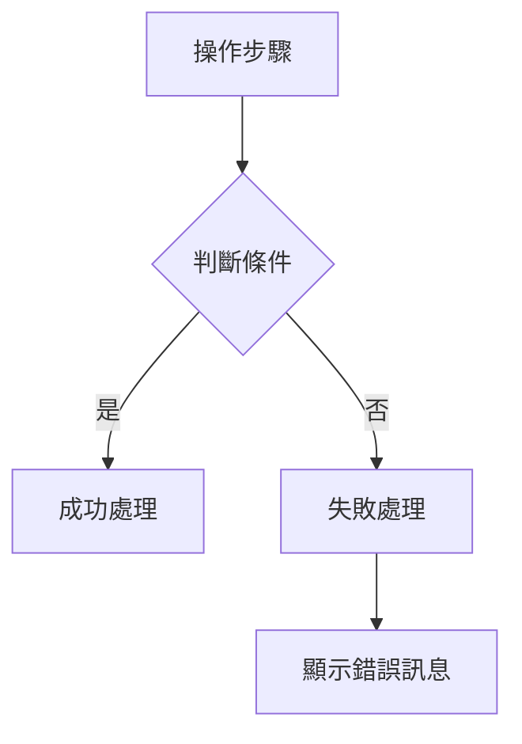

# User Manual HTML 撰寫規範

本文件定義建立使用者手冊 HTML 頁面時必須遵循的標準。所有 user manual HTML 專案皆參考 `/home/ubuntu/qc-web-ipqc/usermanu/` 的實作。

## 專案結構

```
usermanu/
├── index.html                  # 首頁（模組目錄卡片）
├── {module-name}.html          # 各功能模組章節頁面
├── 404.html                    # 404 錯誤頁面
├── css/style.css               # 共用響應式 CSS
├── screenshots/                # 操作截圖（正式引用來源）
├── mobilepic/                  # 手機實拍原圖（JPG 來源備份）
├── images/                     # 流程圖 PNG + Logo
│   └── skyla-logo.png          # Header Logo
├── scripts/                    # Playwright 截圖自動化腳本
└── diagrams/                   # Mermaid 流程圖原始檔
```

### mobilepic/ 資料夾用途

`mobilepic/` 存放從實體手機拍攝的操作截圖原始檔（JPG）。當 Playwright 無法自動擷取的畫面（如需要真實相機掃描 QR 的操作），由使用者手動拍攝後放入此資料夾，再複製到 `screenshots/` 供 HTML 引用。

- 此資料夾為**來源備份**，HTML 頁面不直接引用此資料夾
- 更新截圖時：將新圖放入 `mobilepic/` → 複製到 `screenshots/`
- 若不再需要可刪除，但建議保留作為原圖存檔

## Header 規範

所有頁面的 header **必須**包含 Skyla Logo：

```html
<header class="site-header">
  <div class="header-inner">
    <a href="index.html" class="logo">
      
      IPQC 使用說明
    </a>
    <nav class="main-nav" aria-label="主導覽">
      <!-- CSS-only hamburger toggle -->
      <input type="checkbox" class="nav-toggle-checkbox" id="nav-toggle">
      <label for="nav-toggle" class="nav-toggle" aria-label="開啟選單">☰</label>
      <ul class="nav-list">
        <!-- 各章節連結，當前頁面加上 class="active" -->
        <li><a href="ipqc-dashboard.html">IPQC Dashboard</a></li>
        <li><a href="tutti.html" class="active">Tutti</a></li>
        <!-- ... -->
      </ul>
    </nav>
  </div>
</header>
```

### 導覽連結 active class

當前頁面對應的 nav link **必須**加上 `class="active"`，用於視覺高亮提示使用者目前所在章節：

```html
<!-- 在 tutti.html 中 -->
<li><a href="tutti.html" class="active">Tutti</a></li>

<!-- 在 rd-mobile.html 中 -->
<li><a href="rd-mobile.html" class="active">RD Mobile</a></li>
```

## 截圖規範

### 原則：截圖必須符合文字敘述

- 每個操作步驟的截圖**必須**展示該步驟描述的操作畫面
- 禁止同一模組所有截圖使用相同畫面
- 截圖來源優先順序：
  1. 真實手機/桌面操作截圖（最佳）
  2. Playwright 自動化截圖（透過具體互動操作產生不同畫面）
  3. 禁止使用 placeholder 或通用截圖

### 截圖檔名格式

`{Module}_{description}_{sequence}.{png|jpg}`

範例：`BuildLineMobile_scan_machine_01.jpg`、`RdMobile_curve_fit_04.png`

### 同一截圖只保留一個格式

每張截圖在 `screenshots/` 中**只應保留一個格式**（PNG 或 JPG），避免同一檔名同時存在 `.png` 和 `.jpg` 造成混淆：

- Playwright 自動截圖 → 使用 `.png`
- 手機實拍截圖 → 使用 `.jpg`（從 `mobilepic/` 複製過來）
- HTML 引用時使用實際存在的副檔名
- 若同一截圖有兩種格式，刪除未被 HTML 引用的那個

### 截圖 CSS class

- PC 端截圖：`class="screenshot screenshot--pc"`（max-width: 800px）
- 手機端截圖：`class="screenshot screenshot--mobile"`（max-width: 375px）

### Playwright 截圖互動要求

截圖腳本中，每個截圖任務必須有不同的互動操作：
- 導航到不同頁面/路由
- 點擊按鈕切換狀態（tab、modal、filter）
- 填入表單資料
- 滾動到不同區域
- 等待動畫/資料載入完成

禁止僅靠 `page.goto()` + `page.screenshot()` 產生相同畫面的多張截圖。

## 流程圖規範

### 原則：有 Yes/No 判斷的操作必須有流程圖

當操作流程包含以下情境時，**必須**提供 Mermaid 流程圖（轉換為 PNG）：

- 條件判斷（成功/失敗分支）
- 循環操作（重試、多步驟迴圈）
- 多路徑選擇（A 或 B 操作）

### 流程圖格式

- 原始檔：`usermanu/diagrams/workflow_{module_name}.md`（Mermaid 語法）
- 輸出：`usermanu/images/workflow_{module_name}.png`（透過 mmdc CLI 產生）
- HTML 嵌入方式：

```html
<figure class="workflow-diagram">
  
  <figcaption>{流程圖標題}</figcaption>
</figure>
```

### 流程圖範例



## 錯誤處理規範

每個模組頁面**必須**包含錯誤處理章節，使用以下格式：

```html
<h2>錯誤處理</h2>
<div class="error-section">
  <h3>{錯誤情境名稱}</h3>
  <p>{錯誤描述、原因、以及使用者應如何處理}</p>
</div>
```

### 必須涵蓋的錯誤類型

1. **輸入驗證錯誤** — 必填欄位未填、格式不符
2. **操作失敗** — 網路錯誤、伺服器回應失敗、逾時
3. **業務邏輯錯誤** — 資料不一致、權限不足、查無結果
4. **裝置/環境錯誤**（手機端）— QR 解析失敗、相機權限、替代操作方式

## 頁面內容結構

每個章節頁面必須遵循以下結構順序：

1. `<h1>` 章節標題
2. `<p class="section-overview">` 功能概述
3. URL 存取資訊（如適用）：`<div class="url-info">`
4. 操作步驟（使用 `<ol class="step-list">`）
5. 流程圖（如有 Yes/No 判斷）
6. 錯誤處理章節
7. Footer 頁面導覽（prev / home / next）

### 操作步驟格式

```html
<ol class="step-list">
  <li>
    <p class="step-title">{步驟標題}</p>
    <p class="step-description">{操作說明}</p>
    <p><strong>輸入：</strong>{預期輸入格式或選項}</p>
    <p><strong>成功結果：</strong>{操作成功後的畫面變化}</p>
    
  </li>
</ol>
```

- `step-title` 和 `step-description` 為必填
- `輸入` 和 `成功結果` 為可選欄位，適用於有明確輸入/輸出的步驟（如掃描 QR、填寫表單）
- 每個步驟至少搭配 1 張截圖

## 技術約束

- 純靜態 HTML/CSS，不依賴 JavaScript
- 所有資源路徑使用相對路徑（支援 file:// 離線瀏覽）
- 禁止使用外部 CDN 或絕對路徑
- 響應式設計：320px（手機）至 1920px（桌面）
- 導覽使用 CSS-only hamburger menu（checkbox hack）

## 部署

- 目錄：`/home/ubuntu/qc-web-ipqc/usermanu/`
- Nginx location：`/qc-web/usermanu/`
- Express.js static middleware 已配置於 `server/index.js`

## 檢查清單

建立新 user manual 頁面時，確認以下事項：

- [ ] Header 包含 Skyla Logo
- [ ] 每張截圖對應其文字描述的操作畫面
- [ ] 有條件判斷的流程包含 Mermaid 流程圖
- [ ] 包含錯誤處理章節（至少 2 種錯誤情境）
- [ ] 頁面導覽鏈正確（prev/next/home）
- [ ] 所有路徑為相對路徑
- [ ] 響應式設計正常（手機/桌面）
