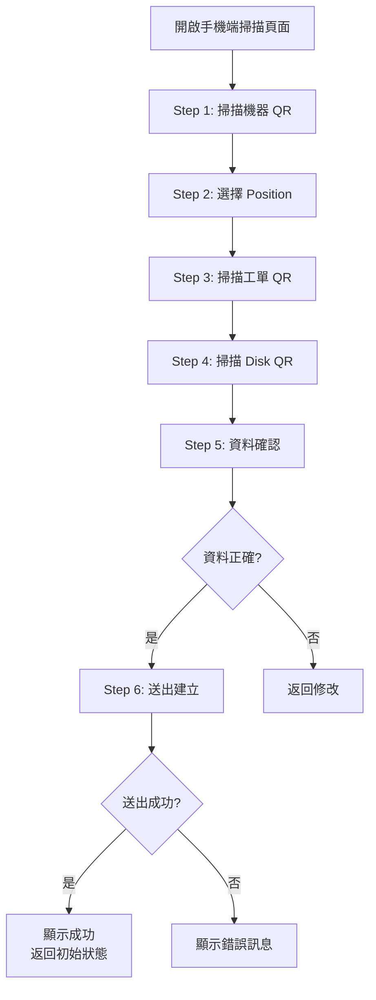

```mermaid
flowchart TD
    A[開啟手機端掃描頁面] --> B[Step 1: 掃描機器 QR]
    B --> C[Step 2: 選擇 Position]
    C --> D[Step 3: 掃描工單 QR]
    D --> E[Step 4: 掃描 Disk QR]
    E --> F[Step 5: 資料確認]
    F --> G{資料正確?}
    G -->|是| H[Step 6: 送出建立]
    G -->|否| I[返回修改]
    H --> J{送出成功?}
    J -->|是| K[顯示成功<br>返回初始狀態]
    J -->|否| L[顯示錯誤訊息]
```
