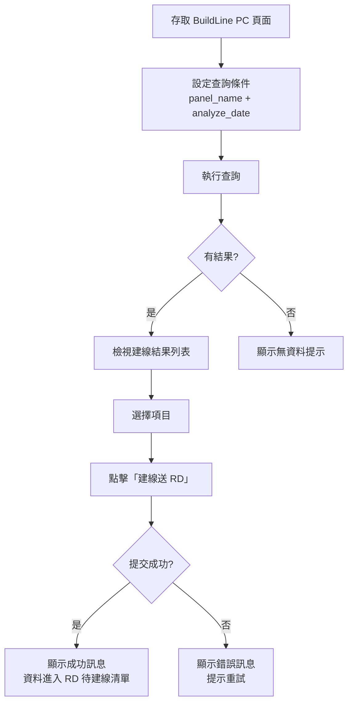

```mermaid
flowchart TD
    A[存取 BuildLine PC 頁面] --> B[設定查詢條件<br>panel_name + analyze_date]
    B --> C[執行查詢]
    C --> D{有結果?}
    D -->|是| E[檢視建線結果列表]
    D -->|否| F[顯示無資料提示]
    E --> G[選擇項目]
    G --> H[點擊「建線送 RD」]
    H --> I{提交成功?}
    I -->|是| J[顯示成功訊息<br>資料進入 RD 待建線清單]
    I -->|否| K[顯示錯誤訊息<br>提示重試]
```
