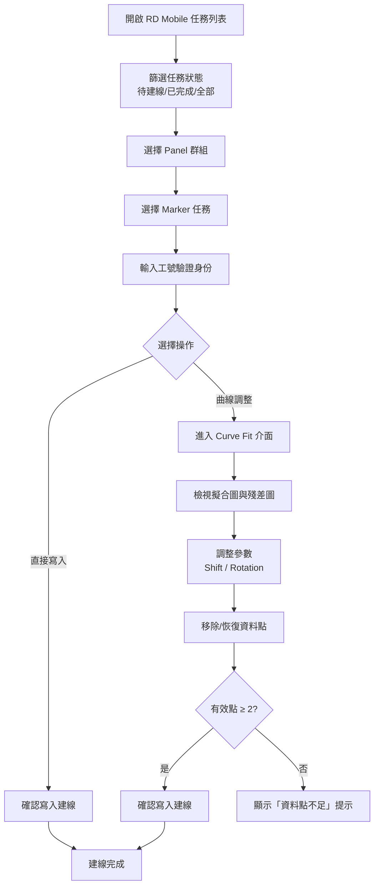

```mermaid
flowchart TD
    A[開啟 RD Mobile 任務列表] --> B[篩選任務狀態<br>待建線/已完成/全部]
    B --> C[選擇 Panel 群組]
    C --> D[選擇 Marker 任務]
    D --> E[輸入工號驗證身份]
    E --> F{選擇操作}
    F -->|直接寫入| G[確認寫入建線]
    F -->|曲線調整| H[進入 Curve Fit 介面]
    H --> I[檢視擬合圖與殘差圖]
    I --> J[調整參數<br>Shift / Rotation]
    J --> K[移除/恢復資料點]
    K --> L{有效點 ≥ 2?}
    L -->|是| M[確認寫入建線]
    L -->|否| N[顯示「資料點不足」提示]
    G --> O[建線完成]
    M --> O
```
