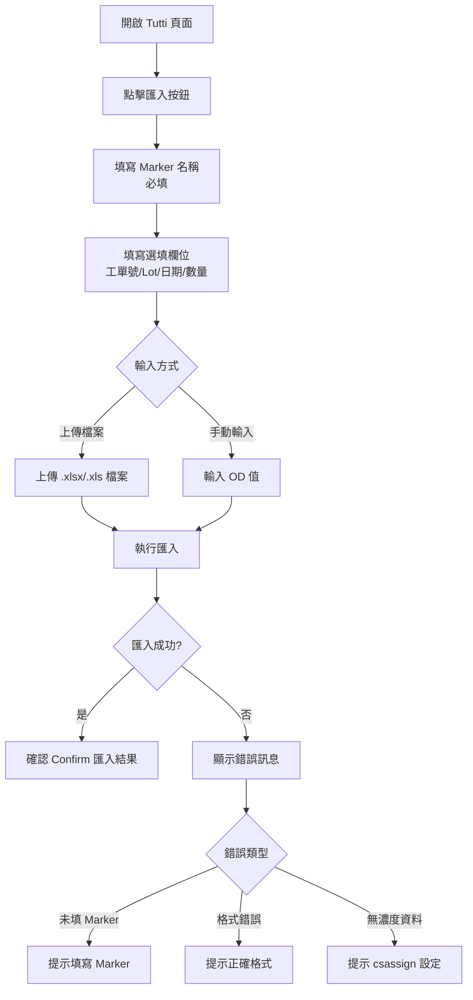

```mermaid
flowchart TD
    A[開啟 Tutti 頁面] --> B[點擊匯入按鈕]
    B --> C[填寫 Marker 名稱<br>必填]
    C --> D[填寫選填欄位<br>工單號/Lot/日期/數量]
    D --> E{輸入方式}
    E -->|上傳檔案| F[上傳 .xlsx/.xls 檔案]
    E -->|手動輸入| G[輸入 OD 值]
    F --> H[執行匯入]
    G --> H
    H --> I{匯入成功?}
    I -->|是| J[確認 Confirm 匯入結果]
    I -->|否| K[顯示錯誤訊息]
    K --> L{錯誤類型}
    L -->|未填 Marker| M[提示填寫 Marker]
    L -->|格式錯誤| N[提示正確格式]
    L -->|無濃度資料| O[提示 csassign 設定]
```
